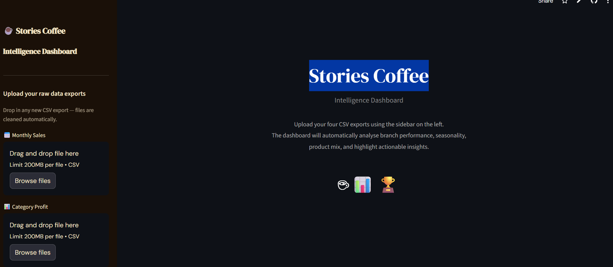

# Stories Coffee – Data Analytics Hackathon

## Business Problem

Stories Coffee operates a growing multi-branch café chain with a diverse product mix spanning beverages, food, and seasonal offerings.  
The leadership team seeks to better understand **what actually drives revenue and profit across branches, products, and seasons**, and where operational or pricing inefficiencies may be silently eroding margins.

The objective of this hackathon project is to transform raw point-of-sale data into **clear, actionable business insights** that can support:

- Smarter menu and upsell strategies  
- Better seasonal planning and staffing  
- Early detection of profit leakage  
- More balanced branch performance across the network  

---

## Approach & Methodology

The analysis follows a structured, layered approach designed to move from **data trust → insight → action**.

### Analysis Layers

#### Part 1 – Data Quality & Exploration
- Missing value audit across all four datasets  
- Descriptive statistics to understand distributions, ranges, and outliers  
- Initial data previews to resolve multi-page exports, repeated headers, and misaligned month blocks  

#### Part 2 – Core Visualisations & Business Analysis
The following analytical views were produced:

- Top 10 products by total profit  
- Beverages vs. Food category comparison  
- Monthly sales performance by branch  
- Top products by profit margin  
- Sales volume vs. margin scatter analysis  
- Branch performance rankings (profit + margin)  
- Seasonality heatmap (branch × month, normalised)  
- Beverages vs. Food deep dive per branch  
- Product group Pareto (revenue concentration)  
- Take-Away vs. Dine-In operational split  
- Margin outliers: loss leaders & high-margin stars  
- New branch ramp-up curves  
- Revenue concentration analysis  

---

## Interactive Intelligence Dashboard (Streamlit)



An interactive **autonomous analytics dashboard** was built using **Streamlit** and is publicly accessible:

🔗 **Live App:** https://stories-ai.streamlit.app/

### Key Characteristics
- Users upload **raw CSV exports** directly from the POS system  
- Data is **cleaned automatically** (multi-page exports, repeated headers, misalignments)  
- Insights and visualisations are generated **without manual intervention**  
- Designed as a **self-service decision-support tool** for business users  

---

## How to Run / Reproduce the Analysis

### Repository Structure

```
├── Stories_data/
├── cleaned_data/
├── notebooks/
├── storiesApp-main/
├── HACKATHON_BRIEF.md
├── requirements.txt
└── README.md
```

---

### Option 1: Google Colab (Recommended)

1. Upload `StoriesCoffee_FullEDA.ipynb` or `StoriesHackathon.ipynb`  
2. Runtime → Run all  
3. All results reproduce automatically  

---

### Option 2: Local Jupyter

```bash
git clone <repo-url>
pip install -r requirements.txt
jupyter notebook StoriesCoffee_FullEDA.ipynb
```

---

### Run Streamlit Locally

#### Windows
```bash
cd storiesApp-main
python -m venv venv
./venv/Scripts/activate
pip install -r requirements.txt
streamlit run app.py
```

#### macOS / Linux
```bash
cd storiesApp-main
python3 -m venv venv
source venv/bin/activate
pip install -r requirements.txt
streamlit run app.py
```

---

## Key Findings

- Frozen Yoghurt represents ~21% of total revenue — the single largest category  
- Beverages outperform food by ~14 margin points across all branches  
- Revenue shows a consistent 3× seasonal swing across the year  
- POS pricing errors create silent negative profit at scale  
- ~50% of chain profit is concentrated in just five branches  

---

## Final Note

This project prioritises **actionable business insight** over academic modeling.
